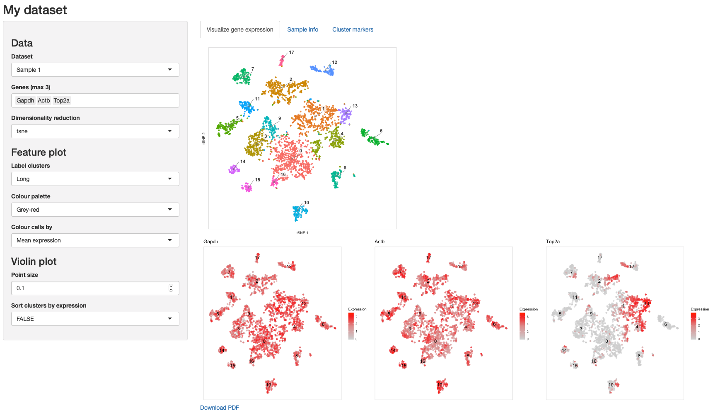

# cytoscope

A simple Shiny app for visualizing single cell data.



## 0. Structure

This app expects the following directory structure with these naming conventions for samples, where `sn_id` corresponds to the ID of sample *n*:

```
app.R
get_genes.R
data/
  seurat_genes.Rda
  markers/
      s1_id.markers.tsv
      ...
      s5_id.markers.tsv
  seurat/
      s1_id.seurat_small.Rda
      ...
      s5_id.seurat_small.Rda
```

You can have as many samples as you like!

## 1. Add your data

### Seurat objects

Currently this works for SC data stored in seurat objects. Since these objects
tend to be large and store a lot of data, most of which are not needed for the simple
functions here, generating smaller versions to be stored alongside this app can dramatically help with speed.
These should be saved in the `data` directory, each named as `sn_id.seurat_small.Rda`.

#### Shrinking Seurat objects

Here is an example function that takes a Seurat object as input, deletes some of the
content not needed for the app, and returns the shrunken object:

```r

reduce_seurat <- function(seurat,
                          n_pcs = 5,
                          keep_raw_data = FALSE) {
  
  # Remove scale.data
  seurat@scale.data <- NULL
  
  # Remove raw data, only used for scaling and differential expression
  # as per https://satijalab.org/seurat/faq
  if (!keep_raw_data) seurat@raw.data <- NULL
  
  # Only keep data for the first few PCs
  seurat@dr$pca@cell.embeddings <- seurat@dr$pca@cell.embeddings[, 1:n_pcs]
  seurat@dr$pca@gene.loadings <- seurat@dr$pca@gene.loadings[, 1:n_pcs]
  
  if (!all(dim(seurat@dr$pca@gene.loadings.full) == 0)) {
    
    seurat@dr$pca@gene.loadings.full <- seurat@dr$pca@gene.loadings.full[, 1:n_pcs]
      
  }
  
  return(seurat)
  
}

```

#### Other requirements

- The app will title certain plots using the `@project.name` slot in the Seurat
objects
- The app expects that a named character vector (names matching cluster names and
values corresponding to colours) is stored at `@misc$colours`

### Cluster markers

The cluster markers can also be provided, allowing them to be searched/filtered
in the app in a separate tab. The output of `Seurat::FindAllMarkers` for each sample can
be saved as a TSV file and saved in the `markers` directory, named as `sn_id.markers.tsv`.

These are the expected columns:

```
p_val	avg_logFC	pct.1	pct.2	p_val_adj	cluster	external_gene_name	ensembl_gene_id	gene_biotype	description
```

The `server` function in the `app.R` script can be easily modified to suit the
columns of your markers files, at the step which generates `output$markers`.

## 2. Prepare `seurat_genes.Rda`

We save the gene lists for each sample to allow them to be searched by the user
in the app when visualizing expression. To prepare this list:

1. Populate the `data` directory (step 1)
2. Modify the indicated lines in `get_genes.R` with your sample IDs
3. Run `$ Rscript get_genes.R` from the top level of the directory storing your app

## 3. Modify `app.R`

Modify the`app.R` script at the indicated lines with your sample IDs. In the example script,
there are two collections of samples - you can have as many collections as you like,
each containing as many samples as you like.

NOTE: The `sn_id` fields **must** match exactly the sample IDs used to name your data.
The `Sample n name` fields can be friendlier versions of the sample IDs, or exactly the same; nothing depends on these and they are just for listing the available datasets within the app.

## 4. Open `app.R` in RStudio and hit `Run App`! 